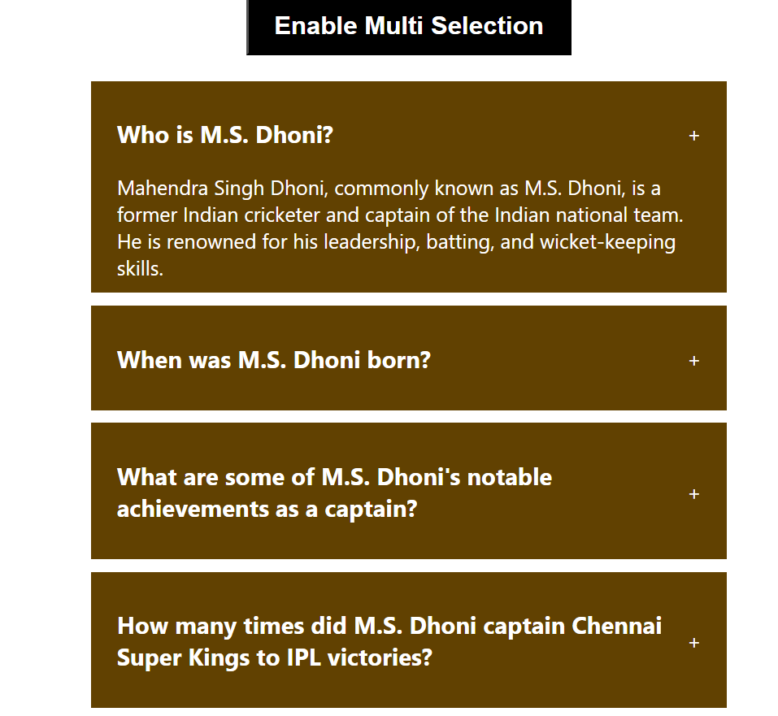

# Code Explanation

The `Accordion` component is a functional component that imports necessary modules and CSS, defines state variables, and provides functions to handle accordion behavior.

#### Imports
```javascript
import data from "./data"; // Imports data from a local file, assumed to be an array of objects
import { useState } from "react"; // Imports the useState hook from React
import "./style.css"; // Imports CSS for styling the component
```

#### State Variables
```javascript
const [selected, setSelected] = useState(null);
const [multipleSelectionButton, setMultipleSelectionButton] = useState(false);
const [multipleQuestionsSelected, setMultipleQuestionsSelected] = useState([]);
```
- `selected`: Holds the ID of the currently selected accordion item. Initialized to `null`.
- `multipleSelectionButton`: Tracks the state of the multi-selection mode. Initialized to `false`.
- `multipleQuestionsSelected`: An array holding the IDs of multiple selected accordion items when multi-selection mode is enabled. Initialized to an empty array.

#### Functions

1. **handleClick**
```javascript
function handleClick(id) {
    setSelected(id === selected ? null : id);
}
```
- Toggles the `selected` state between `null` and the clicked item's ID.
- If the clicked item's ID is already selected, it deselects it by setting `selected` to `null`.

2. **handleMultipleSelectionButtonClick**
```javascript
function handleMultipleSelectionButtonClick() {
    setMultipleSelectionButton(!multipleSelectionButton);
}
```
- Toggles the `multipleSelectionButton` state between `true` and `false`.
- Enables or disables the multi-selection mode.

3. **handleMultipleSelectionClick**
```javascript
function handleMultipleSelectionClick(id) {
    let copyMultipleState = [...multipleQuestionsSelected];
    const findIndexOfId = copyMultipleState.indexOf(id);
    if (findIndexOfId === -1) copyMultipleState.push(id);
    else copyMultipleState.splice(findIndexOfId, 1);

    setMultipleQuestionsSelected(copyMultipleState);
}
```
- Handles selecting and deselecting items in multi-selection mode.
- Creates a copy of `multipleQuestionsSelected` array.
- If the clicked item's ID is not in the array, it adds it.
- If the clicked item's ID is already in the array, it removes it.

#### JSX Structure
```jsx
return (
    <div className="acc-wrapper">
        <button onClick={handleMultipleSelectionButtonClick}>Enable Multi Selection</button>

        <div className="accordion">
            {
                data && data.length > 0 ? 
                data.map((dataItem) => (
                    <div key={dataItem.id} className="item">
                        <div onClick={multipleSelectionButton ? () => handleMultipleSelectionClick(dataItem.id) : () => handleClick(dataItem.id)} className="title">
                            <h3>{dataItem.question}</h3>
                            <span>+</span>
                        </div>
                        {
                            selected === dataItem.id || multipleQuestionsSelected.indexOf(dataItem.id) !== -1 ?
                            <div className="content">
                                {dataItem.answer}
                            </div>
                            : null
                        }
                    </div>
                ))
                : <div></div>
            }
        </div>
    </div>
);
```
- The main container has a class `acc-wrapper`.
- A button toggles the multi-selection mode by calling `handleMultipleSelectionButtonClick`.
- The accordion container iterates over the `data` array using `map`, rendering each `dataItem` as an accordion item.
- The `onClick` event of each item's title calls either `handleMultipleSelectionClick` or `handleClick` based on the state of `multipleSelectionButton`.
- The content of each item is conditionally rendered based on whether its ID matches the `selected` state or is found in the `multipleQuestionsSelected` array.

This structure allows for both single and multiple item selections in an accordion, with a button to toggle between modes.
