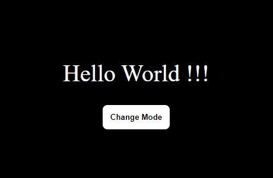
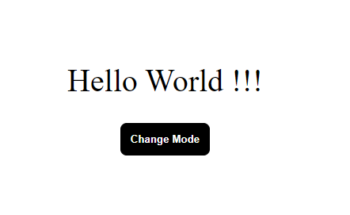

## Dark Mode


## Light Mode



### 1. Custom Hook: `useLocalStorage.jsx`

**Explanation**:
This custom React hook manages and synchronizes state with the `localStorage` API. It's useful for persisting data across page reloads or browser sessions.

#### Code Breakdown:

```jsx
import { useEffect, useState } from "react";

export default function useLocalStorage(key, initialValue) {
    const [value, setValue] = useState(()=>{
        let currentValue;
        try {
            // Tries to get the value from localStorage, or if it doesn't exist, sets it to the initialValue
            currentValue = JSON.parse(
                localStorage.getItem(key) || String(initialValue)
            );
        } catch (error) {
            console.log(error);
            currentValue = initialValue;
        }
        return currentValue;
    });

    useEffect(()=>{
        // Updates the localStorage value whenever 'value' or 'key' changes
        localStorage.setItem(key, JSON.stringify(value));
    }, [key, value]);

    return [value, setValue];
}
```

#### Key Concepts:
- **`useState` with lazy initialization**: The initial state is set using a function (`() => {...}`). This ensures that localStorage access only happens once when the component is first rendered.
- **Error handling**: A `try-catch` block is used to handle possible errors in `JSON.parse` or `localStorage` retrieval.
- **`useEffect` hook**: This hook listens for changes to `key` and `value`, ensuring that the new value is stored in `localStorage` whenever the state changes.
- **Return value**: The hook returns an array, similar to `useState`, consisting of the current value (`value`) and the function to update it (`setValue`).

### 2. Component: `LightDarkMode.jsx`

**Explanation**:
This component uses the `useLocalStorage` hook to toggle between light and dark themes, and it persists the user's theme choice in `localStorage`.

#### Code Breakdown:

```jsx
import useLocalStorage from "./useLocalStorage";
import './theme.css';

export default function LightDarkMode() {
    const [theme, setTheme] = useLocalStorage('theme', 'dark');
     
    function handleToggleMode(){
        setTheme(theme === "light" ? 'dark' : 'light');
    }

    console.log(theme);

    return (
        <div className="light-dark-mode" data-theme={theme}>
            <div className="container">
                <p>Hello World !!!</p>
                <button onClick={handleToggleMode}>Change Mode</button>
            </div>
        </div>
    );
}
```

#### Key Concepts:
- **`useLocalStorage`**: This is used to get the current theme (`light` or `dark`) from `localStorage` and set it as the initial state. It also stores changes back to `localStorage`.
- **`handleToggleMode` function**: This function toggles between light and dark mode by checking the current `theme` value and setting the opposite one.
- **Dynamic `data-theme` attribute**: The `data-theme={theme}` part assigns the current theme to the root div. This can be used in CSS to apply different styles based on the selected theme.
  
#### Functionality:
- The component renders a `div` that contains a button and a message.
- When the button is clicked, `handleToggleMode` toggles the theme and updates the `data-theme` attribute, which triggers CSS changes (in `theme.css`).
- The theme is also saved to `localStorage`, so if the user refreshes the page, the selected theme is preserved. 

### Overall Workflow:
1. **Initial Theme Load**: The `useLocalStorage` hook checks `localStorage` for the previously set theme. If none is found, it defaults to `'dark'`.
2. **Theme Toggle**: When the button is clicked, the `handleToggleMode` function switches the theme between light and dark.
3. **Persistence**: The updated theme is saved back to `localStorage`, so the theme preference is remembered across page reloads or browser sessions.