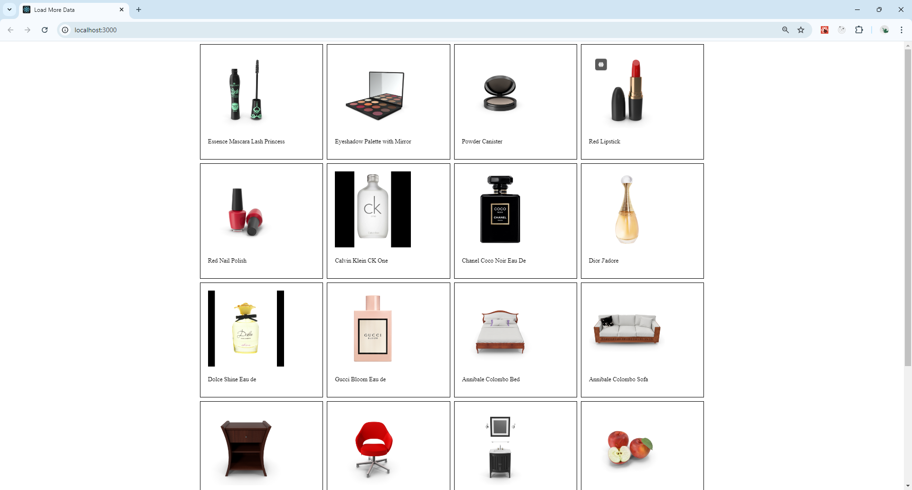

---

## LoadMoreData Component

This React component, `LoadMoreData`, fetches and displays a list of products from an API with a "Load more data" button to fetch additional products in batches of 20. It uses `useState` and `useEffect` hooks to manage state and side effects.

### Imports

```jsx
import { useEffect, useState } from "react";
import './styles.css';
```

- `useEffect` and `useState` are hooks from React.
- A CSS file `styles.css` is imported for styling the component.

### Component Definition

```jsx
export default function LoadMoreData() {
```

Defines a functional component named `LoadMoreData`.

### State Variables

```jsx
const [loading, setLoading] = useState(false);
const [products, setProducts] = useState([]);
const [count, setCount] = useState(0);
const [disableButton, setDisableButton] = useState(false);
```

- `loading`: Boolean state to indicate if data is being loaded.
- `products`: Array state to store fetched product data.
- `count`: Integer state to keep track of how many times the "Load more data" button has been clicked.
- `disableButton`: Boolean state to disable the button after loading 100 products.

### `fetchImages` Function

```jsx
async function fetchImages() {
    try {
        setLoading(true);
        const apiResponse = await fetch(`https://dummyjson.com/products?limit=20&skip=${count === 0 ? 0 : count * 20}`);
        const data = await apiResponse.json();
        if (data && data.products && data.products.length) {
            setProducts((prevData) => [...prevData, ...data.products]);
            setLoading(false);
        }
        console.log(data);
    } catch (error) {
        console.log(error.message);
        setLoading(false);
    }
}
```

- `fetchImages`: An asynchronous function that fetches product data from the API.
  - Sets `loading` to `true` before the request.
  - Constructs the API URL using the `count` state to determine the `skip` parameter.
  - Fetches data from the API and parses the JSON response.
  - If data is received, it appends new products to the existing `products` state.
  - Logs the data to the console.
  - Handles errors by logging the error message and setting `loading` to `false`.

### `useEffect` for Initial and Subsequent Data Fetching

```jsx
useEffect(() => {
    fetchImages();
}, [count]);
```

- This `useEffect` hook runs `fetchImages` whenever `count` changes, triggering a new data fetch each time the "Load more data" button is clicked.

### `useEffect` to Disable Button after 100 Products

```jsx
useEffect(() => {
    if (products && products.length === 100) setDisableButton(true);
}, [products]);
```

- This `useEffect` hook disables the "Load more data" button when the `products` array length reaches 100.

### Conditional Loading Message

```jsx
if (loading) {
    return <div>Loading in process... please wait</div>;
}
```

- Displays a loading message while data is being fetched.

### Component Return

```jsx
return (
    <div className="initial-container">
        <div className="image-container">
            {
                products && products.length ?
                products.map((item, index) => (
                    <div className="product" key={index}>
                        
                        <p>{item.title}</p>
                    </div>
                ))
                : null
            }
        </div>
        <div className="button-container">
            <button disabled={disableButton} onClick={() => setCount(count + 1)}>Load more data</button>
            {disableButton ? <p>You have reached 100 products</p> : null}
        </div>
    </div>
);
```

- Renders the component UI:
  - `initial-container`: Main container div.
  - `image-container`: Contains product images and titles.
    - Maps through the `products` array and displays each product's thumbnail and title.
  - `button-container`: Contains the "Load more data" button and a message when 100 products are loaded.
    - The button is disabled when `disableButton` is `true`.
    - Shows a message indicating that 100 products have been loaded when the button is disabled.

---