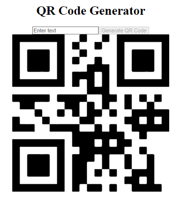

 


**Project Description:**

This is a React-based QR Code Generator application. It allows users to input text and generate a corresponding QR code. The application features a simple user interface with an input field, a generate button, and an area to display the generated QR code.

**Code Explanation:**

1. **Import statements:**
   ```javascript
   import { useState } from 'react';
   import QRcode from 'react-qr-code';
   import './styles.css'
   ```
   The code imports the necessary dependencies: useState hook from React, QRcode component from 'react-qr-code' library, and a CSS file for styling.

2. **QrGenerator component:**
   ```javascript
   export default function QrGenerator() {
     // Component logic here
   }
   ```
   This is the main functional component of the application.

3. **State management:**
   ```javascript
   const [qrCode, setQrCode] = useState('');
   const [input, setInput] = useState('');
   ```
   Two state variables are declared using the useState hook:
   - `qrCode`: Stores the text to be converted into a QR code.
   - `input`: Manages the text in the input field.

4. **handleGenerateQrCode function:**
   ```javascript
   function handleGenerateQrCode() {
     setQrCode(input);
     setInput('');
   }
   ```
   This function is called when the "Generate QR Code" button is clicked. It updates the `qrCode` state with the current `input` value and clears the input field.

5. **Return statement:**

   The component returns JSX that defines the structure of the UI.

6. **Input field:**
   ```javascript
   <input 
     type="text"
     value={input} 
     onChange={(e) => setInput(e.target.value)} 
     placeholder="Enter text" 
     name='qr-code'
   />
   ```
   This input field is controlled by the `input` state. The onChange event updates the `input` state as the user types.

7. **Generate button:**
   ```javascript
   <button
     disabled={input && input.trim() === '' ? false : true}
     onClick={handleGenerateQrCode}
   >
     Generate QR Code
   </button>
   ```
   This button triggers the QR code generation. It's disabled when the input is empty or contains only whitespace.

8. **QR code display:**
   ```javascript
   <QRcode id='qr-code-value' value={qrCode} size={400} bgColor='#fff' />
   
   ```
   This renders the QR code using the `react-qr-code` library. The `value` prop is set to the `qrCode` state, which updates when the generate button is clicked.

This project demonstrates the use of React hooks for state management, handling user input, and integrating a third-party library (react-qr-code) to generate QR codes dynamically based on user input.

