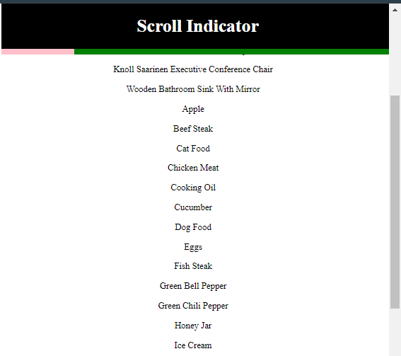

### Project Description: Scroll Indicator with Data Fetching

This project is a React component that integrates a scroll progress bar with data fetching. It tracks the user's scrolling behavior and displays the scroll progress as a visual indicator. Simultaneously, it fetches data from a provided API endpoint and displays the content on the page. The progress bar updates dynamically based on the user's scroll position, while the data loading process is handled in a user-friendly way with error handling and loading states.



-----


### Code Explanation

#### 1. **Imports and State Setup**
```js
import { useEffect, useState } from 'react';
import './scroll.css';
```
The component uses the `useState` and `useEffect` hooks from React to manage state and side effects. It also imports a CSS file to style the scroll indicator and progress bar.

#### 2. **Component State Variables**
```js
const [data, setData] = useState([]);
const [loading, setLoading] = useState(false);
const [errorMessage, setErrorMessage] = useState('');
const [scrollPercentage, setScrollPercentage] = useState(0);
```
- `data`: Holds the fetched data.
- `loading`: Tracks whether the data is currently being fetched.
- `errorMessage`: Stores any error message if the fetch fails.
- `scrollPercentage`: Tracks how far down the page the user has scrolled, in percentage terms.

#### 3. **Asynchronous Data Fetching**
```js
async function fetchData(getUrl){
  try {
     setLoading(true);
     const response = await fetch(getUrl);
     const data = await response.json();

     if(data && data.products && data.products.length){
      setData(data.products);
      setLoading(false);
     }
  } catch (error) {
    console.log(error);
    setErrorMessage(error.message);
  }
}
```
- `fetchData`: Fetches data asynchronously from the `url` prop.
- If successful, the `data` state is updated with the API response.
- If there's an error, the `errorMessage` is set.

#### 4. **Using `useEffect` to Fetch Data**
```js
useEffect(() => {
  fetchData(url);
}, [url]);
```
- The `useEffect` hook calls the `fetchData` function whenever the `url` prop changes. This makes the component re-fetch data dynamically if a new URL is provided.

#### 5. **Scroll Progress Calculation**
```js
function handleScrollPercentage(){
  const scroll = document.body.scrollTop || document.documentElement.scrollTop;
  const height = document.documentElement.scrollHeight - document.documentElement.clientHeight;
  setScrollPercentage((scroll / height) * 100);
}
```
- This function calculates the percentage of the page scrolled by comparing the current scroll position (`scrollTop`) with the total height of the scrollable content (`scrollHeight - clientHeight`).
- The result is then stored in `scrollPercentage`.

#### 6. **Using `useEffect` to Track Scrolling**
```js
useEffect(() => {
  window.addEventListener('scroll', handleScrollPercentage);

  window.removeEventListener('scroll', ()=>{});
}, []);
```
- Another `useEffect` hook listens for the `scroll` event on the window. Whenever the user scrolls, it updates the scroll percentage by calling `handleScrollPercentage`.
- `window.removeEventListener` is called to clean up any previous event listeners (though here it's used incorrectly; this can be improved).

#### 7. **Conditional Rendering Based on State**
```js
if (errorMessage) return <h1>Error! {errorMessage}</h1>;
if (loading) return <h1>Loading... please wait</h1>;
```
- If there is an error or the data is still loading, the component will render an appropriate message to the user.

#### 8. **Rendering the Scroll Indicator and Data**
```js
return (
  <div>
    <div className="top-container">
      <h1>Scroll Indicator</h1>
      <div className='scroll-progress-container'>
        <div className="progress-bar" style={{width: `${scrollPercentage}%`}}></div>
      </div>
    </div>
    
    <div className="data-container">
      {data && data.length ? data.map((item) => <p>{item.title}</p>) : null}
    </div>
  </div>
);
```
- The scroll indicator is displayed as a `progress-bar` whose width is set dynamically according to the `scrollPercentage`.
- The fetched data (if any) is mapped over and displayed as a list of titles.


### Summary
This component demonstrates a clean way to handle API data fetching alongside dynamic scroll progress tracking. It features error handling, a loading state, and a scroll indicator that enhances the user experience.